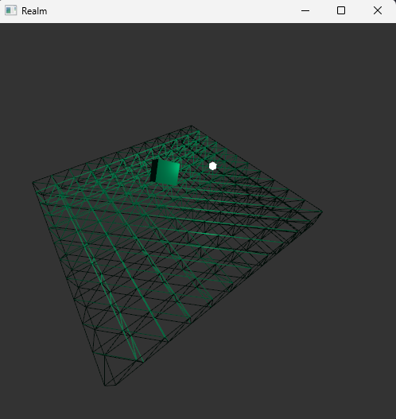

# Realm Engine (OpenGL/Vulkan)



A high-performance graphics engine built on **C23**. Designed for games, 3D simulations, and real-time interactive
applications. This project is a hobbyist exploration of modern graphics APIs and engine architecture.

---

## 🛠 Platform Support

- **Windows**: Primary Development (Stable)
- **Linux**: WIP (~40%)

## 📦 Dependencies

Managed via **vcpkg** manifest mode:

- **OpenGL 3.3 / Vulkan** – Hardware-accelerated rendering
- **FreeType** – Font parsing
- **msdf-atlas-gen** – MSDF font atlas generation
- **Tracy** – Performance profiling
- **GLAD** – Runtime OpenGL loader

## 🚀 Building

### 1. Prerequisites

- **CMake** (3.21+)
- **Ninja** build system
- **Clang** compiler
- **vcpkg** installed with the environment variable `VCPKG_ROOT` pointing to its location.

### 2. Clone the Repository

```bash
git clone --recursive [https://github.com/yourusername/realm-engine](https://github.com/yourusername/realm-engine)
cd realm-engine

```

### 3. Compile

Since the project uses CMake Presets, the dependencies will be automatically installed by vcpkg during the configuration
step.

**Debug Build:**

```bash
cmake --preset debug
cmake --build --preset debug

```

**Release Build:**

```bash
cmake --preset release
cmake --build --preset release

```

## 🗺 Roadmap

The living roadmap lives in `docs/roadmap.md` (key decisions in `docs/decisions.md`).

* [ ] **Engine as a library**: Stable public C API in `engine/include/` (no engine->app includes).
* [ ] **Renderer contract**: Mid-level render packet so backend switches don't change scene semantics.
* [ ] **Asset system v2**: Configured asset root + handles/IDs + hot reload friendly metadata.
* [ ] **Save/Load + Hot Reload**: Versioned serialization of authoritative state, rebuildable runtime caches.
* [ ] **Linux Parity**: Complete windowing/input parity for Linux builds.

## 🤝 Contributing & Contact

If you find this project interesting, feel free to open a pull request!
**Discord:** `friezy`
