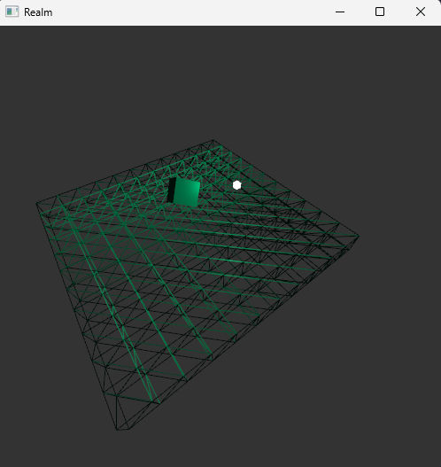

# Realm Engine

[](https://github.com/translibrius/Realm/actions/workflows/build.yml)



A from-scratch game engine written in **C23** with dual **Vulkan** and **OpenGL 3.3** backends. No frameworks, no ECS libraries, no hidden dependencies — just C, graphics APIs, and a lot of manual memory management.

Built as a hobbyist deep dive into engine architecture, renderer design, and the kind of low-level plumbing that game frameworks usually hide from you.

## Features

- **Dual renderer backend** — OpenGL 3.3 and Vulkan, switchable at runtime with a single keypress
- **Hot-reload game module** — edit gameplay code, hit F5, and see changes without restarting. State is preserved across reloads when the layout is compatible
- **Virtual memory arena allocator** — reserve/commit scheme with page-aligned growth, per-frame scratch arenas that auto-clear, and thread-local scratch for async work
- **MTSDF text rendering** — multi-channel signed distance field fonts via msdf-atlas-gen, sharp at any size
- **Async threaded logger** — lock-free ring buffer with a dedicated writer thread, compile-time level stripping in release
- **Persistent TOML config** — window size, position, renderer backend, vsync, and log level auto-saved with a 5-second dirty-flag debounce
- **Tracy profiling** — integrated for frame timing, memory tracking, and zone analysis
- **Custom test harness** — colored terminal output, substring filtering, fail-fast mode
- **In-engine toast notifications** — info/warning/error popups surfaced from the game module
- **Splash screen** — native platform splash (no GL/Vulkan required) while assets load

## Architecture

```
realm/ (host executable)
  ├── main.c              → bootstraps engine, creates window, enters frame loop
  ├── realm_app_loader    → loads/reloads the game module DLL at runtime
  ├── realm_app_watcher   → file watcher that detects rebuilds
  └── realm_app_module/   → the hot-reloadable game module (shared library)

engine/ (shared library)
  ├── include/            → stable public API (the only headers realm/ may use)
  └── src/
      ├── renderer/       → backend-agnostic frontend + opengl/ and vulkan/ implementations
      ├── asset/          → static asset registry indexed by enum ID
      ├── core/           → logger, events, camera, config
      ├── memory/         → arena allocator, tracked malloc/free
      └── platform/       → win32, macOS, linux (WIP) abstraction
```

The host owns game state memory. The game module exports `init` / `update` / `render` / `shutdown` and declares its state size and version. On hot reload, state is reused if the layout matches — otherwise it reinitializes cleanly.

The renderer is never touched by game code directly. The game fills an `rl_frame_data` struct (camera, meshes, lights, text) and submits it — the active backend handles the rest.

## Platforms

| Platform | Status |
|----------|--------|
| Windows  | Primary, stable |
| macOS    | Active development |
| Linux    | WIP (~40%) |

## Building

**Prerequisites:** CMake 3.20+, Ninja, Clang, Git

```bash
git clone --recursive https://github.com/translibrius/Realm
cd Realm

cmake --preset debug && cmake --build --preset debug
# or
cmake --preset release && cmake --build --preset release
```

Dependencies (FreeType, shaderc, Vulkan headers) are managed via vcpkg manifest mode. If `VCPKG_ROOT` is set, your existing installation is used. Otherwise, vcpkg is fetched automatically into `.vcpkg/` on first configure.

### Build Options

| Option | Default | Description |
|--------|---------|-------------|
| `REALM_WERROR` | `OFF` | Treat compiler warnings as errors |
| `REALM_BUILD_TESTS` | `ON` | Build the unit test executable |

```bash
# Enable warnings-as-errors (always on in CI)
cmake --preset debug -DREALM_WERROR=ON
```

## Running

```bash
./build/debug/bin/Realm
```

## Keybindings

| Key | Action |
|-----|--------|
| `W` `A` `S` `D` | Move camera |
| `Space` / `LShift` | Move up / down |
| Mouse | Look around |
| `Enter` | Pause / resume |
| `Escape` | Pause (press again to quit) |
| `F5` | Rebuild and hot-reload game module |
| `F10` | Switch renderer backend (OpenGL / Vulkan) |
| `F11` | Toggle borderless / windowed |
| `M` | Print memory usage to console |

## Tests

```bash
ctest --preset debug

# Run tests, then launch the app if they pass
cmake --build --preset debug --target run_realm_checked

# Filter or list tests directly
./build/debug/bin/RealmTests --list
./build/debug/bin/RealmTests --filter <pattern>
./build/debug/bin/RealmTests --fail-fast
```

## Contact

**Discord:** `friezy`
